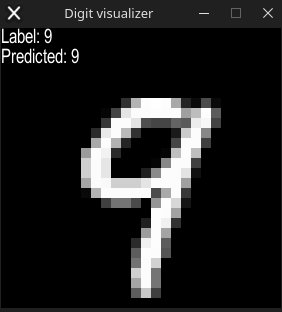

## mnist.rs
A neural network implementation written in rust from scratch.

It classifies handwritten digits from the [mnist dataset](https://web.archive.org/web/20220331130319/https://yann.lecun.com/exdb/mnist/). The mnist dataset contains 60000 training and 10000 testing 28x28 images. The model is quite simple with 784 input neurons for every pixel in the image, 100 hidden neurons in a single hidden layer and 10 neurons in the output layer. The model was trained in 10 epochs with 60, 1000 image batches. This resulted in a 8.2% accuracy on the testing data, and a 49.001667% accuracy on the training data. Those are very low metrics, but I feel like if the model is trained more, with more hidden layers, that the accuracy will improve. This project is as a result of me trying to understand neural networks and deep learning, so there's a high chance that my implementation is buggy. Feel free to reach out if you have anything to fix.

Some things to come back to:
- Parameter serialization: it would be nice to be able to write the weights and biases to
  a file after training.
- Optimize matrix operations: either utilze SIMD instructions or add GPU support

The source code is licensed under the MIT license. Happy hacking.
